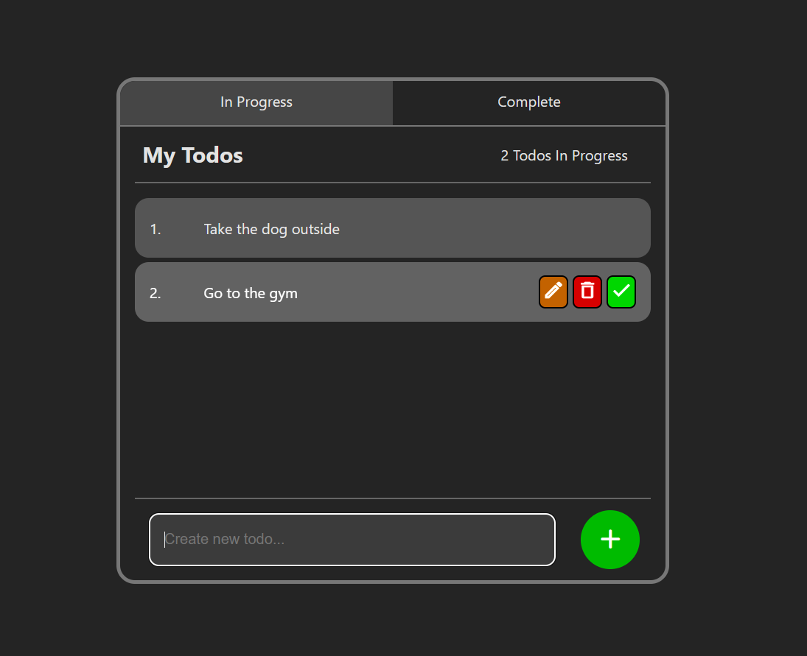

# ReactJS TodoList

## Description

A to-do list app built with ReactJS using the Vite build tool. This simple app allows the user to view their to-dos in a list. Users can add, update, and delete their to-dos in the list, as well as mark them complete, using an intuitive user interface. The user can view their "In Progress" and "Complete" todos in two separate lists by using the tabs at the top of the screen.

## Motivation

I was accustomed to using create-react-app to create ReactJS applications, but heard great things about Vite, and decided I wanted to give it try. Having never built a todo app before, I decided a todo app would be a fun side-project and that Vite would be my build tool. Vite has certainly lived up to it's positive reputation and I greatly recommend it as well. I will absolutely be using it for future applications.

Creating this application was great practice for a few things.
- To start, I made sure to design the UI first. I had an idea in mind, so I created a wireframe on paper with pencil. This really helped me hit the ground running when I started coding, because I knew what I was building and how it would look. It is immensely useful to have a wireframe or GUI mockup as a reference. While it may seem obvious that design should come before implementation, it can be very easy to want to just start coding when you have an idea, and things can quickly get messy, even with a simple todo app.
- While an initial motivation for the project was to try out Vite, this project was also great practice for my ReactJS skills. The project is purely React; data is not persisted in anyway. With the app in its current state, it would not be too much work to hook up a database or persistence layer to the project. I decided against this though, as this application was meant to be a side project from a larger, more ambitious project.

---

## Example

Here is a simple screenshot of the Todo app user interface:

---

## Features

### Add Todo

The controls at the bottom of the todo app user interface allows the user to add todos to their list of todos. The controls are a form with a submit button (the Add todo button), so the user may either click the button or simply press Enter on their keyboards.

---

### Update Todo

To update a todo, the user can click the orange pencil icon button on the todo to begin editting, or they may double click the todo data itself. A form input will appear with the todo data inside. Once the user is done editting, they can hit Enter on their keyboard to stop editting the todo, as the input field is actually inside a form with an invisible submit button. The user may also simply click anywhere outside the form field to stop editting.

---

### Delete Todo

To delete a todo, the user clicks the red trash can button on the todo they would like to delete. The todo will then turn red and ask the user to confirm that they want to delete the todo. A confirm or cancel button is provided for the user to either confirm the delete or simply cancel.

---

### Complete Todo

In this todo app, the user can mark their todos as complete. This does not delete the todo, but removes it from the list of "In Progress" todos and moves them to a list of "Complete" todos. To do this, the user clicks the green checkmark button on the todo to complete. Then, the user must confirm this action (just like with deleting a todo) to complete the todo, or simply cancel. In the list of complete todos, the complete todos are counted separately from the in progress todos.

---
